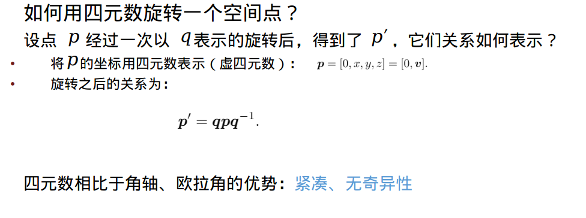

# slam十四讲学习之三维空间刚体运动（二）

## 1.点和坐标系

向量的运算可由坐标运算表达
加法和减法
**内积（点乘）**

**外积（叉乘）**

## 2.旋转矩阵

## 3.旋转向量和欧拉角

**旋转向量**
方向为旋转轴，长度为转过的角度
称为角轴/轴角（Angle Axis）或旋转向量（Rotation Vector）

由于万向乐锁的存在，欧拉角不适合插值或迭代
多用于人机交互中
可以证明：仅用三个实数表达旋转时，不可避免地存在奇异性问题
SLAM中亦很少用欧拉角表达姿态

## 4.四元素

