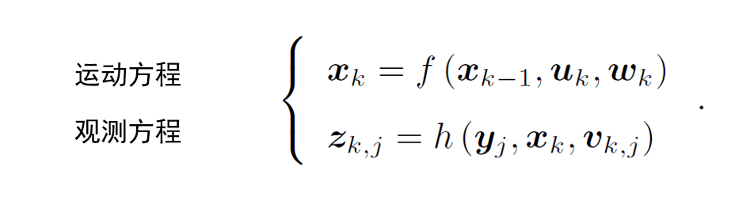

# slam学习之基础(一)

​	SLAM (simultaneous localization and mapping),也称为CML (Concurrent Mapping and Localization), 即时定位与地图构建，或并发建图与定位。问题可以描述为：将一个[机器人](https://baike.baidu.com/item/%E6%9C%BA%E5%99%A8%E4%BA%BA/888)放入未知环境中的未知位置，是否有办法让机器人一边移动一边逐步描绘出此环境完全的地图，所谓完全的地图（a consistent map）是指不受障碍行进到房间可进入的每个角落。

## **传感器**

1.机器人感知外界环境的手段

种类：内质的/外质的

内质：感受机器人本体信息

IMU、激光、相机

外质：安装于环境中的

二维码Marker、GPS、导轨、磁条

环境限制了传感器的形式

GPS：需要能接收到卫星信号的环境

Marker、导轨：需要环境允许安装

相比之下，激光、相机等携带式传感器更加自由

**相机**

以一定速率采集图像、形成视频

分类

单目相机Monocular

双目相机（立体相机） Stereo

深度相机 RGB-D

其他 全景、Event Camera

**相机的特点**

以二维投影形式记录了三维世界的信息

该过程丢掉了一个维度：距离

**各类相机的区别**

单目：无深度深度需要其他手段估计

双目：通过视差计算深度

RGB-D：通过物理方法测量深度

##  **视觉SLAM框架**

前端：VisualOdometry

后端：Optimization

回环：LoopClosing

建图：Mapping

**视觉里程计**

估计邻近时刻的相机运动

最简化：两个图像的相对运动

**方法**

特征点法

直接法

**后端**

从带有噪声的数据中估计最优轨迹与地图

最大后验概率估计

滤波器

图优化

**回环检测**

检测相机是否到达过之前位置

判断与之前位置的差异

计算图像间相似性

词袋模型

**建图**

导航、规划、通讯、交互、可视化

度量地图、拓扑地图

稀疏地图、稠密地图

## 视觉SALM的数学描述

